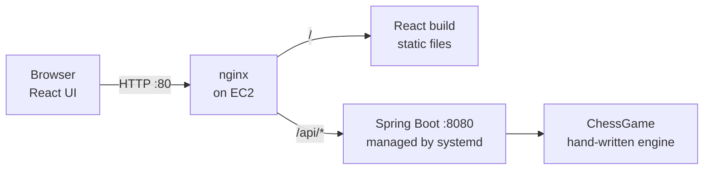

# ♞ Chess — play a friend from any device

A two-player online chess game. One person starts a game and shares a link or a 6-character code; the other joins and you play in real time from separate devices. No accounts, no sign-up.

The rules engine is written from scratch in Java (no chess libraries). It is wrapped in a Spring Boot REST API and played through a React UI. The whole thing is deployed on AWS.

**Live demo:** http://13.201.74.123 *(running on a small EC2 instance; may be offline when I'm not using it)*

<!-- Add a screenshot: save it as docs/screenshot.png and uncomment the line below -->
<!--  -->

## Features

- Create a game, share the invite link, and play from two different devices
- Full legal-move validation: you can't leave your own king in check, and pinned pieces can't move
- Check, checkmate and stalemate detection
- Pawn promotion (auto-Queen)
- Click a piece to see its legal moves highlighted; last move and checked king are highlighted
- Each player sees the board from their own side
- Refreshing the page keeps your seat in the game
- Console version of the game still works

## Architecture



```
React (board UI)  --polls every 1s-->  Spring Boot REST API  -->  ChessGame (engine, in memory)
```

**Engine layers:** `File/Location` → `Square` → `Board` → `Piece` (Pawn, Rook, Knight, Bishop, Queen, King) → `ChessGame`.
Each piece generates its own pseudo-legal moves; `MoveValidator` then makes each candidate move on the board, checks whether the mover's own king is attacked, and undoes it. Check, checkmate and stalemate all build on that single rule.

**Multiplayer:** the server keeps each game in memory. Joining a game gives you a secret `playerId` (UUID) that the server checks on every move, so only the right player can move on their turn. The browser polls the game state once a second to see the opponent's moves. Each game is guarded by a lock so two requests can't change it at the same time.

## Tech stack

| Layer | Tech |
|---|---|
| Frontend | React 18, Vite |
| Backend | Java 17+, Spring Boot 3.3 (REST) |
| Engine | Plain Java, no dependencies |
| Tests | JUnit 5 |
| Hosting | AWS EC2 (Amazon Linux 2023), nginx, systemd |

## Run locally

Needs JDK 17+, Maven and Node 18+.

```bash
# terminal 1 - API on :8080
cd backend
mvn spring-boot:run

# terminal 2 - UI on :5173
cd frontend
npm install
npm run dev
```

Open http://localhost:5173 → **Start a new game** → copy the invite link → open it on another device
(or in a **private/incognito window**; each browser profile is one "player", so two normal tabs in the same browser will both be the same player).

In development, Vite forwards `/api` calls to `localhost:8080`, so no CORS setup is needed.

Console version: run `com.chess.runner.Game` and enter moves like `E2->E4`.

Tests: `cd backend && mvn test`

## API

| Method | Path | What |
|---|---|---|
| POST | `/api/games` | create a game (you play White) → `{gameId, playerId, color}` |
| POST | `/api/games/{id}/join` | join by code (you play Black) |
| GET | `/api/games/{id}` | board, turn, status (polled by the UI) |
| GET | `/api/games/{id}/moves?from=E2&playerId=…` | legal destinations for a piece |
| POST | `/api/games/{id}/move` | `{playerId, from, to}` |

Game status is one of `WAITING_FOR_OPPONENT`, `IN_PROGRESS`, `CHECKMATE`, `STALEMATE`.
Errors come back as JSON with a `message` (404 unknown game, 403 not a player, 409 not your turn / game full, 400 illegal move).

## Project structure

```
backend/
  src/main/java/com/chess/
    board/ common/ piece/ squares/   the engine (board, pieces, locations)
    game/                            ChessGame (turn, status, promotion), MoveValidator (check logic)
    api/                             GameController, GameService, DTOs, CORS config
    runner/Game.java                 console version
  src/test/java/com/chess/           engine tests
frontend/
  src/App.jsx                        create / join flow
  src/components/GameScreen.jsx      polling + click handling
  src/components/Board.jsx           the board
```

## Tests

Engine tests cover: White moves first, fool's mate, answering a check, a pinned piece that can't move, pawn promotion with a capture, and Sam Loyd's 10-move stalemate (a long game that exercises check and pin logic end to end).

## Deployment (AWS)

```
Browser ──http──► EC2 (nginx :80) ──/──────► /usr/share/nginx/html   (React build)
                                  └─/api/*──► localhost:8080         (Spring Boot jar)
```

- **EC2:** `t3.micro`-class instance running Amazon Linux 2023 with Amazon Corretto 21
- **systemd** runs the Spring Boot jar, restarts it on failure and starts it on boot
- **nginx** serves the React files and reverse-proxies `/api/` to Spring Boot, so the browser talks to one address (no CORS)
- **Security group:** SSH (22) from my IP only, HTTP (80) from anywhere. Port 8080 only needs to be open for debugging, since nginx reaches Spring Boot on the same machine

### Deploy / update

```bash
# build
cd backend  && mvn clean package
cd ../frontend && npm install && npm run build

# backend: upload the jar, restart the service
scp -i ~/.ssh/<key>.pem backend/target/chess-backend-0.0.1.jar ec2-user@<server-ip>:~/chess-backend.jar
ssh -i ~/.ssh/<key>.pem ec2-user@<server-ip> "sudo systemctl restart chess"

# frontend: upload the build and copy it into nginx's folder
scp -i ~/.ssh/<key>.pem -r frontend/dist ec2-user@<server-ip>:~/
ssh -i ~/.ssh/<key>.pem ec2-user@<server-ip> "sudo rm -rf /usr/share/nginx/html/* && sudo cp -r ~/dist/* /usr/share/nginx/html/"
```

Logs: `sudo journalctl -u chess -n 50` (backend) and `sudo journalctl -u nginx -n 50` (nginx).

## Limitations and roadmap

**Rules not implemented yet:** castling, en passant, choosing a promotion piece (always Queen), draw by repetition, draw by insufficient material, resign / draw offers.

**Technical limitations:**
- Games live in memory and are lost when the server restarts
- Plain HTTP only (no TLS). Adding CloudFront + HTTPS is planned, which would also let the "Copy invite link" button use the clipboard directly
- The UI polls every second; WebSockets would be more efficient
- Finished games are not saved

**Ideas:**
- Save finished games (moves, result) in PostgreSQL on RDS
- WebSockets (STOMP) instead of polling
- Castling and en passant
- Move history and a rematch button
- CI/CD with GitHub Actions
